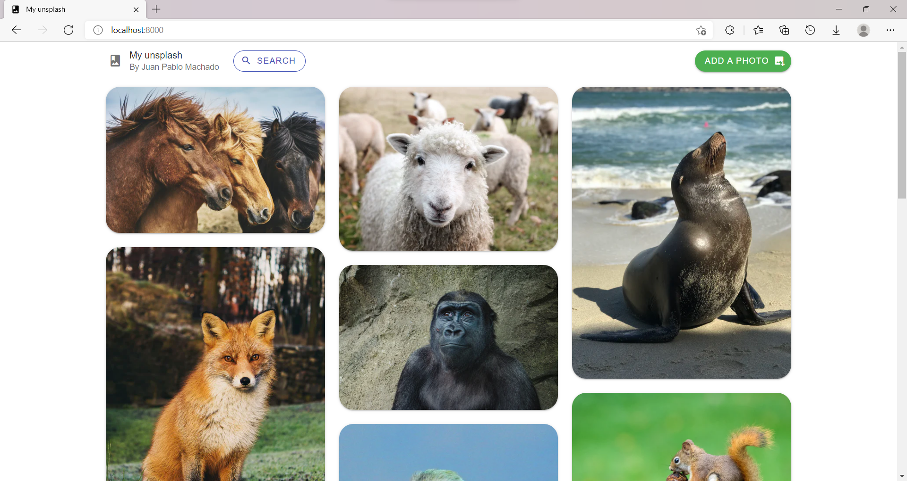

# My unsplash - simple clone

This project was inspired by a challenge from the [DevChallenges](https://devchallenges.io/) site. The main objective of the [challenge](https://devchallenges.io/challenges/rYyhwJAxMfES5jNQ9YsP) is to develop an application that complies with the indicated user stories.



### Table of contents 📃

- [My unsplash - simple clone](#my-unsplash---simple-clone)
    - [Table of contents 📃](#table-of-contents-)
  - [Starting 🚀](#starting-)
    - [Pre-requirements 📋](#pre-requirements-)
    - [Installation 🔧](#installation-)
  - [Deployment 📦](#deployment-)
  - [Built with 🛠️](#built-with-️)


## Starting 🚀
  
### Pre-requirements 📋

* [Git](https://git-scm.com/)
* [Vue.js 2.6 via npm](https://es.vuejs.org/v2/guide/installation.html#NPM)
* [Laravel 8 via composer](https://laravel.com/docs/8.x/installation#installation-via-composer)

### Installation 🔧

Local installation:

```bash
# Clone this repository
$ git clone https://github.com/your-user-name/your-project-name

# Change directory to the project path
$ cd your-project-name

# Install dependencies
$ composer install
$ npm install

# Copy .env file
$ cp .env.example .env

# Generate key
$ php artisan key:generate
```

Firebase database configuration:

```bash
1. Create firebase project.
2. Go to 'Realtime Database' and create database. (Test mode)
3. Copy database url. (Url like 'https://project-00000-default-rtdb.firebaseio.com/')
4. Go to 'rules' and modify like this:
{
  "rules": {
    ".read": true
    ".write": true
    "photos": {
      ".read": true,
    	".write": true,
    	".indexOn": ["label", "created_at"]
    }
  }
}
```
```bash
5. Go to 'Storage' and create storage. (Test mode)
6. After that, go to 'Project configuration' > 'Service account' > Click on button 'generate new private key'.
7. Download json file and put it on the project''s root path.
```

.env file setup:

```bash
FIREBASE_CREDENTIALS=json-file-name
FIREBASE_DATABASE_URL=database-url
```

## Deployment 📦

```bash
# Run laravel
$ php artisan serve

# Run vue with npm (dev mode)
$ npm run dev
```
Open [http://localhost:8000](http://localhost:8000) to view it in your browser.

## Built with 🛠️

* [Vue.js](https://es.vuejs.org/) - Frontend framework
* [Laravel](https://laravel.com/) - Backend framework
* [Vuetify](https://vuetifyjs.com/en/) - Material design framework for vue
* [Firebase database](https://firebase.google.com/) - Cloud-hosted database

---
⌨️ with ❤️ by [Juan Pablo Machado](https://github.com/Ju4npx ) 😊 